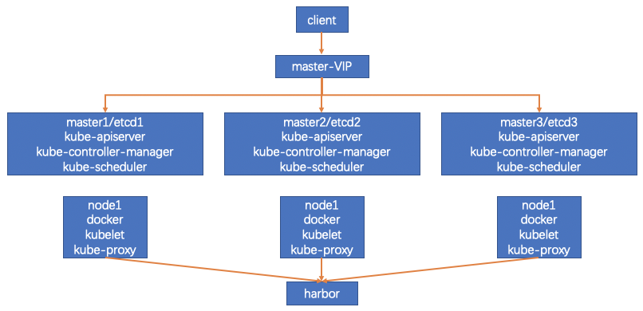

# kubernetes 1.18.0 部署文档

## 一、环境信息

### 1、组件版本

| ROLE |  INFO |
| :--- | :--- |
| Kubernetes | 1.18.0 |
| System | CentOS Linux release 7.8.2003 \(Core\) |
| Docker | Docker version 19.03.8 |
| Etcd | v3.4.7 |
| Flanneld | v0.12.0-amd64 |
| Cfssl | Version: 1.2.0 |
| Harbor | v1.10.2 |
| Cni | v0.8.5 |

### 2、集群网络规划

host-net : 192.168.0.0/16

svc-net : 172.30.1.0/24

pod-net : 10.1.0.0/16

### 3、节点规划

master1/etcd1

master2/etcd2

master3/etcd3

node1

node2

node3

### 4、集群逻辑图



## 二、系统初始化

### 1、修改主机名

#### 

#### 2、配置host文件

#### 

#### 3、安装依赖包

#### 

#### 4、关闭防火墙

#### 

#### 5、关闭swap

#### 

#### 6、关闭selinux

#### 

#### 7、配置时间同步

#### 

#### 8、系统参数设置

#### 

#### 9、加载内核模块

#### 

#### 10、配置免密环境

#### 

#### 11、升级系统内核

#### 

#### 12、上传kubernetes-install资源包

### 

## 三、ca证书环境

### 1、安装cfssl

#### **1.1下载cfssl**

```text
curl -L 
https://pkg.cfssl.org/R1.2/cfssl_linux-amd64
 -o /usr/bin/cfssl
curl -L 
https://pkg.cfssl.org/R1.2/cfssljson_linux-amd64
 -o /usr/bin/cfssljson
curl -L 
https://pkg.cfssl.org/R1.2/cfssl-certinfo_linux-amd64
 -o /usr/bin/cfssl-certinfo
chmod +x /usr/bin/cfssl /usr/bin/cfssljson /usr/bin/cfssl-certinfo
```

#### 

### 2、创建ca证书&秘钥

```text
mkdir -p /opt/ssl/csr
```


etcd各节点都要执行


## 四、部署etcd

#### 

### 1、安装etcd

#### 

### 2、为etcd签发证书

#### 

### 3、验证集群状态

### 

## 五、部署master节点

#### 

### 1、安装kubenetes-server相关命令

#### 

### 2、签发kube-apiserver证书并部署服务

#### 

### 3、部署kube-controller-manager服务

#### 

### 4、部署kube-scheduler服务

#### 

### 5、签发admin证书并部署kubectl环境

### 

## 六、部署harbor私有仓库

### 

## 七、部署node节点

#### 

### 1、部署docker环境

#### 

### 2、签发kubelet-bootstrap证书并部署kubelet服务

#### 

### 3、签发kube-proxy证书证书并部署服务

### 

## 八、部署网络插件flannel

### 

## 九、部署coredns解析服务

### 

## 十、部署kuboard集群管理服务

