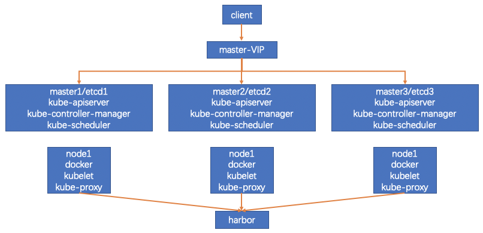

# 一、环境信息

## 1、组件版本

操作系统: CentOS Linux release 7.8.2003 \(Core\) 最小化安装 

Kubernetes: 1.18.0 

Docker: Docker version 19.03.8, build afacb8b 

Etcd: v3.4.7 

cni: v0.8.5 

Flanneld: v0.12.0-amd64 

Cfssl: Version: 1.2.0 

Harbor: v1.10.2

## 2、集群网络规划

host-net : 192.168.0.0/16 

svc-net : 172.30.1.0/24

pod-net : 10.1.0.0/16 

## 3、节点规划

master1/etcd1

master2/etcd2

master3/etcd3

node1

node2

node3

## 4、集群规划图

